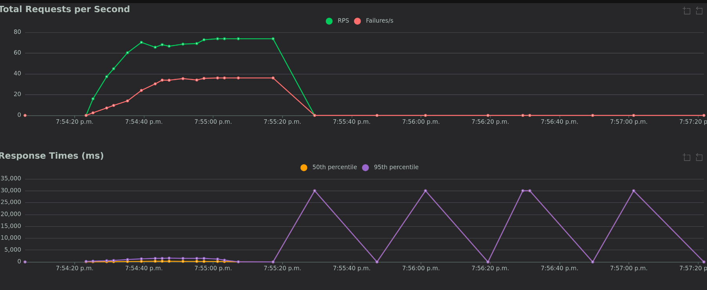
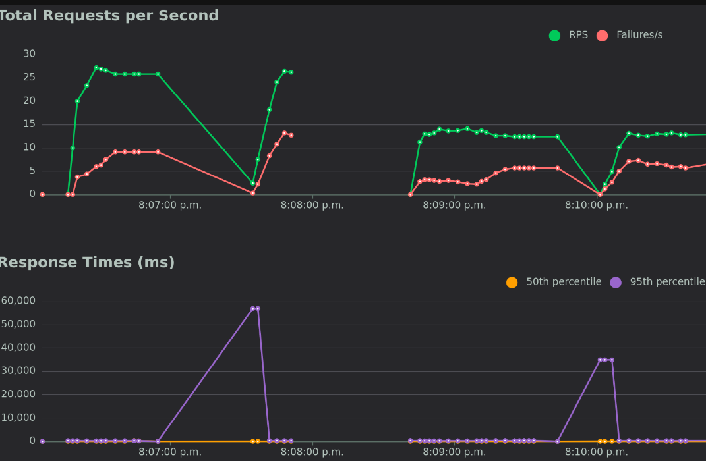
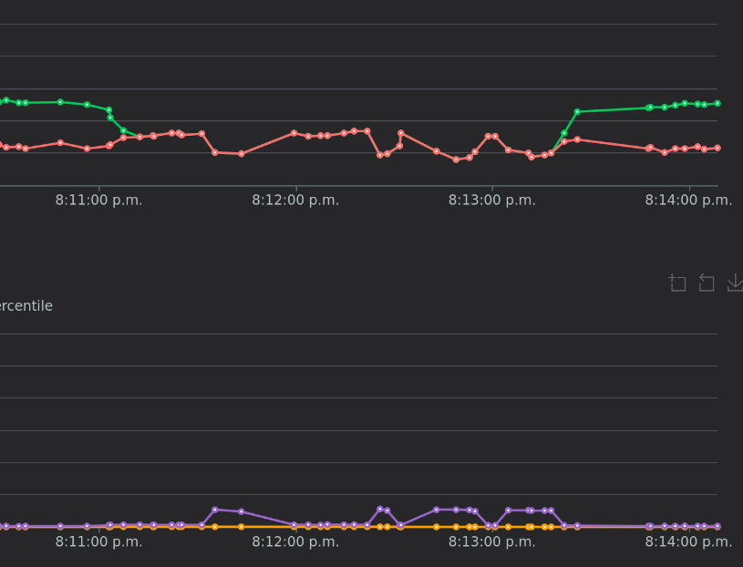
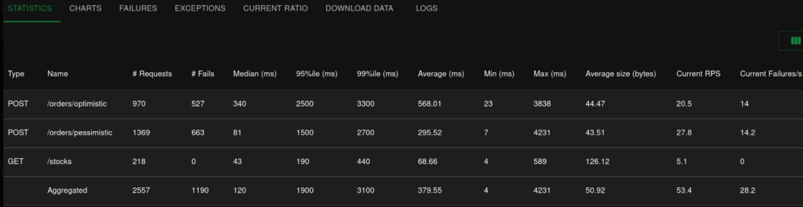
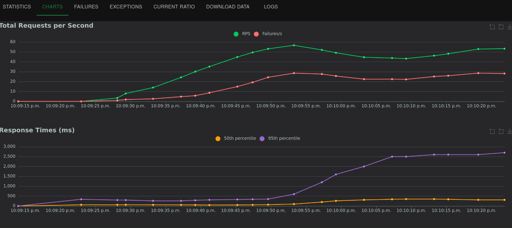
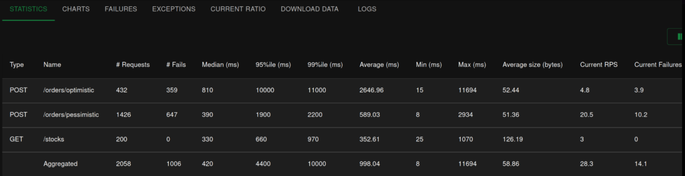
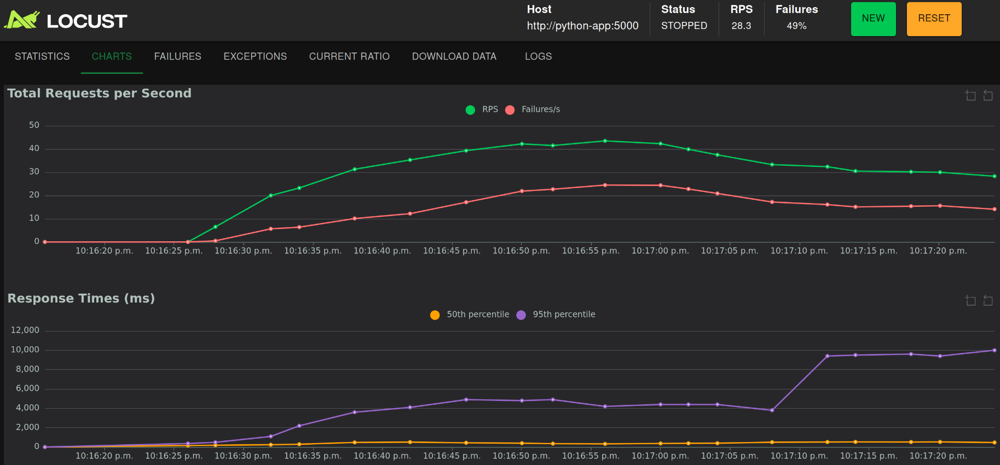

# LOG430 - Rapport du laboratoire 02
ÉTS - LOG430 - Architecture logicielle - Hiver 2026 - Groupe 1

Étudiant: Yanni Haddar
Nom github: mapleduck
repo github: https://github.com/mapleduck/log430-labo9

## Questions

> 💡 Question 1 : Quelle est la sortie du terminal que vous obtenez? Si vous répétez cette commande sur yugabyte2 et yugabyte3, est-ce que la sortie est identique? Illustrez votre réponse avec des captures d'écran ou des sorties du terminal.

Vérification du tableau, il est bel et bien vide.
```
 id | user_id | total_amount | payment_link | is_paid | created_at
----+---------+--------------+--------------+---------+------------ 
0 rows
```

Le test a été lancé, son résultat est en annexe : TEST 0

Le tableau comporte maintenant:
```
"SELECT * FROM orders;"
 id  | user_id | total_amount | payment_link | is_paid |          created_at           
-----+---------+--------------+--------------+---------+-------------------------------
   1 |       2 |         5.75 |              | f       | 2026-04-02 23:14:55.15376+00
 101 |       1 |         5.75 |              | f       | 2026-04-02 23:14:55.22291+00
   2 |       1 |         5.75 |              | f       | 2026-04-02 23:14:55.654463+00
   3 |       1 |         5.75 |              | f       | 2026-04-02 23:14:55.748293+00
(4 rows)
```

De plus, les tableaux dans yugabyte2 et yugabyte3 contiennent exactement les meme valeurs. La sortie est identique sur les 3, ce qui démontre de facon concrète la réplication automatique de YuagabyteDB, chaque écriture est validée sur le noeud leader et propagée aux followers via le protocole Raft avant d'être confirmée.

> 💡 Question 2 : Observez la latence moyenne des deux approches affichée dans la sortie du test. Laquelle a la latence moyenne la plus élevée et pourquoi? Illustrez votre réponse avec les sorties du terminal.

Le résultat du deuxième test en annexe: TEST 1
La latence semble plus élevée (0.288s > 0.443s) en moyenne. La moyenne sur Optimiste est plus élevée (0.443s vs 0.360s). Une des raisons probable est le méchanisme de retry dans create_order_optimistic. Quand un conflit est détecté (result.rwocount == 0) la transaction restart au complet avec un délai aléatoire.
```
time.sleep(random.uniform(0.01, 0.05))
# puis recommence jusqu'à max_retries = 5
```

Avec 20 threads et seulement 2 unités, presque tout les threads détectent un conflit et se retentent plusieurs fois, ce qui accumule les délais. Vu que l'approche pessimiste bloque les transactions via SELECT ... FOR UPDATE, elle a une latence consistente.

> 💡 Question 3 : Répétez le test avec 5 threads au lieu de 20. Quelle approche a actuellement la latence moyenne la plus élevée et pourquoi? Illustrez votre réponse avec les sorties du terminal.

Le résultat du test en annexe: TEST 2

Avec 5 threads, l'approche optimiste a encore une latence plus élevée (différence négligeable), mais l'approche pessimiste a une latence de succès plus élevée (0.136s > 0.120s). Cela est plus proche du résultat attendu, car la transaction optimiste devrait elle plus rapide - elle ne pose aucun verrou lors de la lecture, elle lit le stock et la version sans bloquer:
```
row = session.execute(
    text("SELECT quantity, version FROM stocks WHERE product_id = :pid"),
    {"pid": pid},
).fetchone()
```

Avec seulement 5 threads, il y a peu de conflits. Les transactions réussissent du premier coup sans retry. Les transactions pessimistent sont toujours dans la même file d'attente du aux select for update, ce qui leur donne une latence prévisible, mais inévitable.


> 💡 Question 4 : En utilisant YugabyteDB, quelle stratégie de verrouillage affiche le plus bas taux d'erreurs et la plus baisse latence moyenne? Illustrez votre réponse avec des captures d'écran ou statistiques de l'interface Locust.

Tableau Locust:
| Type | Name | # Requests | # Fails | Median (ms) | 95%ile (ms) | 99%ile (ms) | Average (ms) | Min (ms) | Max (ms) | Average size (bytes) | Current RPS | Current Failures/s |
| :--- | :--- | :---: | :---: | :---: | :---: | :---: | :---: | :---: | :---: | :---: | :---: | :---: |
| POST | `/orders/optimistic` | 1731 | 1093 | 380 | 1200 | 1800 | 448.82 | 27 | 2734 | 46.54 | 28.9 | 25.2 |
| POST | `/orders/pessimistic` | 2744 | 1495 | 78 | 600 | 1100 | 163.86 | 7 | 1850 | 45.15 | 52 | 40.9 |
| GET | `/stocks` | 440 | 0 | 43 | 210 | 320 | 68.45 | 5 | 345 | 125.4 | 8.2 | 0 |
| | **Aggregated** | **4915** | **2588** | **160** | **810** | **1400** | **255.68** | **5** | **2734** | **52.83** | **89.1** | **66.1** |

Le verrouillage pessimiste affiche la latence la plus basse, et les deux stratégies ont des taux d'erreurs élevés mais comparables.

Le verouillage pessimiste a une latence plus basse overall, car avec 50 utilisateurs, les conflits de l'optimiste avec le sleep randomcause des grosses latances, contre le pessimiste qui contrôle mieux avec SELECT ... FOR UPDATE, comme discuté si haut.

> 💡 Question 5 : Est-ce que le taux d'erreur a augmenté lors de l'arrêt du nœud? Combien de temps a duré le basculement (approximativement)? Illustrez votre réponse avec des captures d'écran et statistiques de l'interface Locust.

Plusieurs problèmes ont eu lieu lors de ce test. Tout d'abord, lorsque yugabyte2 se faisait arrêter, j'avais juste une perte complète des requêtes. Plus de success OU failures, et infinie latence.



Après un restart, les requêtes font juste reprendre normalement.



Vous pouvez voir que cela arrivait même en réduisant drastiquement le nombre de users concurrent (20 puis 5). Cela est hautement innabituel.

En observant les logs des docker, il semblent que lorsque n'importe lequel des deux slaves (yugabyte2 ou yugabyte3) est tué, TOUTES les requêtes cessent. Store manager cessent **toutes** les requêtes, et n'accepte plus aucune demande. Cela explique le fait que Locust n'arrive plus à recevoir de réponse - son nombre de requête tombe (et reste) à zéro et la latence augmente jusqu'à timeout.

Dans l'impossibilité de trouver la cause de cela, j'ai finalement tenté de tuer yugabyte1 (le master).


On observe ici quelque chose de plus utile pour notre analyse. On peut voir que quand yugabyte1 est tué, le nombre de requête devient le nombre d'erreur. Plus rien ne passe. Malheureusement, il n'y a toujours pas de fallback sur un des slaves...je n'ai pas le temps de trouver la cause dans le code fourni. Mais, on peut voir que quand yugabyte1 est rallumé, les requêtes reprennent comme si de rien n'était. Donc, il y a une forme de recovery.

Pour répondre aux deux prochaines questions, j'ai refait les deux tests à partir de DBs vides depuis zéro pour avoir une clean slate.

YugobyteDB:



CockroachDB:



> 💡 Question 6 : En utilisant CockroachDB, quelle stratégie de verrouillage affiche le plus bas taux d'erreurs et la plus baisse latence? Illustrez votre réponse avec des captures d'écran ou statistiques de l'interface Locust.


Le pessimiste affiche le plus bas taux d'erreurs (45% vs 83%) et la plus basse latence (390ms vs 810ms). Le graphique confirme que le 95e percentile de l'optimiste monte jusqu'à ~10 000ms, ce qui confirme que les retires s'accumulent massivement, et l'effet est plus prononcé que sur YugabyteDB.

> 💡 Question 7 : Quelle base de données affiche le plus bas taux d'erreurs et la plus baisse latence? Est-ce que c'est YugabyteDB ou CockroachDB? Illustrez votre réponse avec des captures d'écran ou statistiques de l'interface Locust.

Les résultats sont inconclusifs, chaque framework a ses avantages et inconvénients.

YugabyteDB a une latence plus basse, la médiane pessimiste est 78ms vs 390ms pour CockroachDB, et le débit est légèrement plus élevé. Le response time de cockroach explose à 10 000ms vers la fin, alors que YugabyteDB restait stable à 3000ms.

CockroachDB a un taux d'erreurs un peu plus bas sur le pessimiste, mais au prix d'un débit beaucoup plus bas. Mais cela est négligeable, surtout face à l'énorme latence de YugabyteDB.

Dans notre environnement, il semble qu'en terme de performance, YugabyteDB est la solution nettement supérieure.

## Déploiement

### Prérequis
- Docker et Docker Compose installés
- GitHub Actions runner self-hosted configuré sur la VM

### Démarrage local
```bash
docker compose up -d --wait
```

### Test de concurrence
Le test sera exécuté automatiquement, sinon le déploiement ne sera pas fait.

### Résultat du CI
Le CI fonctionnent parfaitement - il créé un environnement de test, lance le test, s'assure qu'il fonctionne, puis cleanup tout et déploie l'application. Voir le screenshot ci-dessous, ou allez sur le repo directement pour voir les logs en détail - chaque étape fonctionne parfaitement.

### CI/CD
Le pipeline GitHub Actions exécute automatiquement le test de concurrence à chaque push sur `main`, puis déploie si les tests passent.

## Annexe
### Test 0
```
# python tests/concurrency_test.py --threads 5 --product 3
2026-04-02 23:14:54 - concurrency_test - DEBUG - 
╔══════════════════════════════════════════════════════════╗
2026-04-02 23:14:54 - concurrency_test - DEBUG - ║        Test de concurrence – Verrous distribués          ║
2026-04-02 23:14:54 - concurrency_test - DEBUG - ╚══════════════════════════════════════════════════════════╝
2026-04-02 23:14:54 - concurrency_test - DEBUG -   Hôte    : http://localhost:5000
2026-04-02 23:14:54 - concurrency_test - DEBUG -   Threads : 5
2026-04-02 23:14:54 - concurrency_test - DEBUG -   Produit : 3
2026-04-02 23:14:54 - concurrency_test - DEBUG - 
============================================================
2026-04-02 23:14:54 - concurrency_test - DEBUG -   Stratégie : Pessimiste (SELECT FOR UPDATE)
2026-04-02 23:14:54 - concurrency_test - DEBUG -   Endpoint  : /orders/pessimistic
2026-04-02 23:14:54 - concurrency_test - DEBUG -   Threads   : 5  (tous libérés simultanément)
2026-04-02 23:14:54 - concurrency_test - DEBUG -   Article   : 3
2026-04-02 23:14:54 - concurrency_test - DEBUG - ============================================================
2026-04-02 23:14:55 - concurrency_test - DEBUG -   Stocks réinitialisés ✓

2026-04-02 23:14:55 - concurrency_test - DEBUG -   ✅ thread 0  user_id=1  HTTP 201  0.436s  →  {'order_id': 101, 'total': '5.75'}
2026-04-02 23:14:55 - concurrency_test - DEBUG -   ✅ thread 1  user_id=2  HTTP 201  0.291s  →  {'order_id': 1, 'total': '5.75'}
2026-04-02 23:14:55 - concurrency_test - DEBUG -   ❌ thread 2  user_id=3  HTTP 409  0.442s  →  {'error': 'Order failed (stock or constraint issue)'}
2026-04-02 23:14:55 - concurrency_test - DEBUG -   ❌ thread 3  user_id=1  HTTP 409  0.453s  →  {'error': 'Order failed (stock or constraint issue)'}
2026-04-02 23:14:55 - concurrency_test - DEBUG -   ❌ thread 4  user_id=2  HTTP 409  0.462s  →  {'error': 'Order failed (stock or constraint issue)'}
2026-04-02 23:14:55 - concurrency_test - DEBUG - 
  Résultat : 2 commande(s) réussie(s), 3 échouée(s) sur 5 threads
2026-04-02 23:14:55 - concurrency_test - DEBUG -   Latence moyenne (succès)  : 0.363s
2026-04-02 23:14:55 - concurrency_test - DEBUG -   Latence moyenne (échecs)  : 0.452s
2026-04-02 23:14:55 - concurrency_test - DEBUG -   Latence moyenne (total)   : 0.417s
2026-04-02 23:14:55 - concurrency_test - DEBUG - 
============================================================
2026-04-02 23:14:55 - concurrency_test - DEBUG -   Stratégie : Optimiste  (version + UPDATE conditionnel)
2026-04-02 23:14:55 - concurrency_test - DEBUG -   Endpoint  : /orders/optimistic
2026-04-02 23:14:55 - concurrency_test - DEBUG -   Threads   : 5  (tous libérés simultanément)
2026-04-02 23:14:55 - concurrency_test - DEBUG -   Article   : 3
2026-04-02 23:14:55 - concurrency_test - DEBUG - ============================================================
2026-04-02 23:14:55 - concurrency_test - DEBUG -   Stocks réinitialisés ✓

2026-04-02 23:14:56 - concurrency_test - DEBUG -   ✅ thread 0  user_id=1  HTTP 201  0.126s  →  {'order_id': 2, 'total': '5.75'}
2026-04-02 23:14:56 - concurrency_test - DEBUG -   ❌ thread 1  user_id=2  HTTP 409  0.367s  →  {'error': 'Order failed (stock or constraint issue)'}
2026-04-02 23:14:56 - concurrency_test - DEBUG -   ❌ thread 2  user_id=3  HTTP 409  0.334s  →  {'error': 'Order failed (stock or constraint issue)'}
2026-04-02 23:14:56 - concurrency_test - DEBUG -   ✅ thread 3  user_id=1  HTTP 201  0.17s  →  {'order_id': 3, 'total': '5.75'}
2026-04-02 23:14:56 - concurrency_test - DEBUG -   ❌ thread 4  user_id=2  HTTP 409  0.444s  →  {'error': 'Order failed (stock or constraint issue)'}
2026-04-02 23:14:56 - concurrency_test - DEBUG - 
  Résultat : 2 commande(s) réussie(s), 3 échouée(s) sur 5 threads
2026-04-02 23:14:56 - concurrency_test - DEBUG -   Latence moyenne (succès)  : 0.148s
2026-04-02 23:14:56 - concurrency_test - DEBUG -   Latence moyenne (échecs)  : 0.382s
2026-04-02 23:14:56 - concurrency_test - DEBUG -   Latence moyenne (total)   : 0.288s
2026-04-02 23:14:56 - concurrency_test - DEBUG - 
✔ Tests terminés.
```

### Test 1 - 20 threads
```
# python tests/concurrency_test.py --threads 20 --product 3
2026-04-02 23:19:38 - concurrency_test - DEBUG - 
╔══════════════════════════════════════════════════════════╗
2026-04-02 23:19:38 - concurrency_test - DEBUG - ║        Test de concurrence – Verrous distribués          ║
2026-04-02 23:19:38 - concurrency_test - DEBUG - ╚══════════════════════════════════════════════════════════╝
2026-04-02 23:19:38 - concurrency_test - DEBUG -   Hôte    : http://localhost:5000
2026-04-02 23:19:38 - concurrency_test - DEBUG -   Threads : 20
2026-04-02 23:19:38 - concurrency_test - DEBUG -   Produit : 3
2026-04-02 23:19:38 - concurrency_test - DEBUG - 
============================================================
2026-04-02 23:19:38 - concurrency_test - DEBUG -   Stratégie : Pessimiste (SELECT FOR UPDATE)
2026-04-02 23:19:38 - concurrency_test - DEBUG -   Endpoint  : /orders/pessimistic
2026-04-02 23:19:38 - concurrency_test - DEBUG -   Threads   : 20  (tous libérés simultanément)
2026-04-02 23:19:38 - concurrency_test - DEBUG -   Article   : 3
2026-04-02 23:19:38 - concurrency_test - DEBUG - ============================================================
2026-04-02 23:19:38 - concurrency_test - DEBUG -   Stocks réinitialisés ✓

2026-04-02 23:19:38 - concurrency_test - DEBUG -   ❌ thread 0  user_id=1  HTTP 409  0.398s  →  {'error': 'Order failed (stock or constraint issue)'}
2026-04-02 23:19:38 - concurrency_test - DEBUG -   ✅ thread 1  user_id=2  HTTP 201  0.285s  →  {'order_id': 301, 'total': '5.75'}
2026-04-02 23:19:38 - concurrency_test - DEBUG -   ❌ thread 2  user_id=3  HTTP 409  0.437s  →  {'error': 'Order failed (stock or constraint issue)'}
2026-04-02 23:19:38 - concurrency_test - DEBUG -   ❌ thread 3  user_id=1  HTTP 409  0.358s  →  {'error': 'Order failed (stock or constraint issue)'}
2026-04-02 23:19:38 - concurrency_test - DEBUG -   ❌ thread 4  user_id=2  HTTP 409  0.308s  →  {'error': 'Order failed (stock or constraint issue)'}
2026-04-02 23:19:38 - concurrency_test - DEBUG -   ❌ thread 5  user_id=3  HTTP 409  0.29s  →  {'error': 'Order failed (stock or constraint issue)'}
2026-04-02 23:19:38 - concurrency_test - DEBUG -   ❌ thread 6  user_id=1  HTTP 409  0.373s  →  {'error': 'Order failed (stock or constraint issue)'}
2026-04-02 23:19:38 - concurrency_test - DEBUG -   ❌ thread 7  user_id=2  HTTP 409  0.332s  →  {'error': 'Order failed (stock or constraint issue)'}
2026-04-02 23:19:38 - concurrency_test - DEBUG -   ❌ thread 8  user_id=3  HTTP 409  0.372s  →  {'error': 'Order failed (stock or constraint issue)'}
2026-04-02 23:19:38 - concurrency_test - DEBUG -   ❌ thread 9  user_id=1  HTTP 409  0.34s  →  {'error': 'Order failed (stock or constraint issue)'}
2026-04-02 23:19:38 - concurrency_test - DEBUG -   ❌ thread 10  user_id=2  HTTP 409  0.312s  →  {'error': 'Order failed (stock or constraint issue)'}
2026-04-02 23:19:38 - concurrency_test - DEBUG -   ✅ thread 11  user_id=3  HTTP 201  0.226s  →  {'order_id': 201, 'total': '5.75'}
2026-04-02 23:19:38 - concurrency_test - DEBUG -   ❌ thread 12  user_id=1  HTTP 409  0.42s  →  {'error': 'Order failed (stock or constraint issue)'}
2026-04-02 23:19:38 - concurrency_test - DEBUG -   ❌ thread 13  user_id=2  HTTP 409  0.346s  →  {'error': 'Order failed (stock or constraint issue)'}
2026-04-02 23:19:38 - concurrency_test - DEBUG -   ❌ thread 14  user_id=3  HTTP 409  0.43s  →  {'error': 'Order failed (stock or constraint issue)'}
2026-04-02 23:19:38 - concurrency_test - DEBUG -   ❌ thread 15  user_id=1  HTTP 409  0.427s  →  {'error': 'Order failed (stock or constraint issue)'}
2026-04-02 23:19:38 - concurrency_test - DEBUG -   ❌ thread 16  user_id=2  HTTP 409  0.401s  →  {'error': 'Order failed (stock or constraint issue)'}
2026-04-02 23:19:38 - concurrency_test - DEBUG -   ❌ thread 17  user_id=3  HTTP 409  0.323s  →  {'error': 'Order failed (stock or constraint issue)'}
2026-04-02 23:19:38 - concurrency_test - DEBUG -   ❌ thread 18  user_id=1  HTTP 409  0.406s  →  {'error': 'Order failed (stock or constraint issue)'}
2026-04-02 23:19:38 - concurrency_test - DEBUG -   ❌ thread 19  user_id=2  HTTP 409  0.422s  →  {'error': 'Order failed (stock or constraint issue)'}
2026-04-02 23:19:38 - concurrency_test - DEBUG - 
  Résultat : 2 commande(s) réussie(s), 18 échouée(s) sur 20 threads
2026-04-02 23:19:38 - concurrency_test - DEBUG -   Latence moyenne (succès)  : 0.256s
2026-04-02 23:19:38 - concurrency_test - DEBUG -   Latence moyenne (échecs)  : 0.372s
2026-04-02 23:19:38 - concurrency_test - DEBUG -   Latence moyenne (total)   : 0.36s
2026-04-02 23:19:38 - concurrency_test - DEBUG - 
============================================================
2026-04-02 23:19:38 - concurrency_test - DEBUG -   Stratégie : Optimiste  (version + UPDATE conditionnel)
2026-04-02 23:19:38 - concurrency_test - DEBUG -   Endpoint  : /orders/optimistic
2026-04-02 23:19:38 - concurrency_test - DEBUG -   Threads   : 20  (tous libérés simultanément)
2026-04-02 23:19:38 - concurrency_test - DEBUG -   Article   : 3
2026-04-02 23:19:38 - concurrency_test - DEBUG - ============================================================
2026-04-02 23:19:38 - concurrency_test - DEBUG -   Stocks réinitialisés ✓

2026-04-02 23:19:39 - concurrency_test - DEBUG -   ❌ thread 0  user_id=1  HTTP 409  0.546s  →  {'error': 'Order failed (stock or constraint issue)'}
2026-04-02 23:19:39 - concurrency_test - DEBUG -   ✅ thread 1  user_id=2  HTTP 201  0.301s  →  {'order_id': 401, 'total': '5.75'}
2026-04-02 23:19:39 - concurrency_test - DEBUG -   ❌ thread 2  user_id=3  HTTP 409  0.407s  →  {'error': 'Order failed (stock or constraint issue)'}
2026-04-02 23:19:39 - concurrency_test - DEBUG -   ❌ thread 3  user_id=1  HTTP 409  0.443s  →  {'error': 'Order failed (stock or constraint issue)'}
2026-04-02 23:19:39 - concurrency_test - DEBUG -   ❌ thread 4  user_id=2  HTTP 409  0.427s  →  {'error': 'Order failed (stock or constraint issue)'}
2026-04-02 23:19:39 - concurrency_test - DEBUG -   ❌ thread 5  user_id=3  HTTP 409  0.467s  →  {'error': 'Order failed (stock or constraint issue)'}
2026-04-02 23:19:39 - concurrency_test - DEBUG -   ❌ thread 6  user_id=1  HTTP 409  0.452s  →  {'error': 'Order failed (stock or constraint issue)'}
2026-04-02 23:19:39 - concurrency_test - DEBUG -   ❌ thread 7  user_id=2  HTTP 409  0.429s  →  {'error': 'Order failed (stock or constraint issue)'}
2026-04-02 23:19:39 - concurrency_test - DEBUG -   ❌ thread 8  user_id=3  HTTP 409  0.432s  →  {'error': 'Order failed (stock or constraint issue)'}
2026-04-02 23:19:39 - concurrency_test - DEBUG -   ❌ thread 9  user_id=1  HTTP 409  0.473s  →  {'error': 'Order failed (stock or constraint issue)'}
2026-04-02 23:19:39 - concurrency_test - DEBUG -   ❌ thread 10  user_id=2  HTTP 409  0.457s  →  {'error': 'Order failed (stock or constraint issue)'}
2026-04-02 23:19:39 - concurrency_test - DEBUG -   ❌ thread 11  user_id=3  HTTP 409  0.463s  →  {'error': 'Order failed (stock or constraint issue)'}
2026-04-02 23:19:39 - concurrency_test - DEBUG -   ❌ thread 12  user_id=1  HTTP 409  0.446s  →  {'error': 'Order failed (stock or constraint issue)'}
2026-04-02 23:19:39 - concurrency_test - DEBUG -   ❌ thread 13  user_id=2  HTTP 409  0.498s  →  {'error': 'Order failed (stock or constraint issue)'}
2026-04-02 23:19:39 - concurrency_test - DEBUG -   ❌ thread 14  user_id=3  HTTP 409  0.55s  →  {'error': 'Order failed (stock or constraint issue)'}
2026-04-02 23:19:39 - concurrency_test - DEBUG -   ❌ thread 15  user_id=1  HTTP 409  0.388s  →  {'error': 'Order failed (stock or constraint issue)'}
2026-04-02 23:19:39 - concurrency_test - DEBUG -   ❌ thread 16  user_id=2  HTTP 409  0.521s  →  {'error': 'Order failed (stock or constraint issue)'}
2026-04-02 23:19:39 - concurrency_test - DEBUG -   ✅ thread 17  user_id=3  HTTP 201  0.166s  →  {'order_id': 202, 'total': '5.75'}
2026-04-02 23:19:39 - concurrency_test - DEBUG -   ❌ thread 18  user_id=1  HTTP 409  0.573s  →  {'error': 'Order failed (stock or constraint issue)'}
2026-04-02 23:19:39 - concurrency_test - DEBUG -   ❌ thread 19  user_id=2  HTTP 409  0.431s  →  {'error': 'Order failed (stock or constraint issue)'}
2026-04-02 23:19:39 - concurrency_test - DEBUG - 
  Résultat : 2 commande(s) réussie(s), 18 échouée(s) sur 20 threads
2026-04-02 23:19:39 - concurrency_test - DEBUG -   Latence moyenne (succès)  : 0.233s
2026-04-02 23:19:39 - concurrency_test - DEBUG -   Latence moyenne (échecs)  : 0.467s
2026-04-02 23:19:39 - concurrency_test - DEBUG -   Latence moyenne (total)   : 0.443s
2026-04-02 23:19:39 - concurrency_test - DEBUG - 
✔ Tests terminés.
```

### Test 2 - 5 threads
```
root@81f8a21fb406:/app/src# python tests/concurrency_test.py --threads 5 --product 3
2026-04-02 23:27:23 - concurrency_test - DEBUG - 
╔══════════════════════════════════════════════════════════╗
2026-04-02 23:27:23 - concurrency_test - DEBUG - ║        Test de concurrence – Verrous distribués          ║
2026-04-02 23:27:23 - concurrency_test - DEBUG - ╚══════════════════════════════════════════════════════════╝
2026-04-02 23:27:23 - concurrency_test - DEBUG -   Hôte    : http://localhost:5000
2026-04-02 23:27:23 - concurrency_test - DEBUG -   Threads : 5
2026-04-02 23:27:23 - concurrency_test - DEBUG -   Produit : 3
2026-04-02 23:27:23 - concurrency_test - DEBUG - 
============================================================
2026-04-02 23:27:23 - concurrency_test - DEBUG -   Stratégie : Pessimiste (SELECT FOR UPDATE)
2026-04-02 23:27:23 - concurrency_test - DEBUG -   Endpoint  : /orders/pessimistic
2026-04-02 23:27:23 - concurrency_test - DEBUG -   Threads   : 5  (tous libérés simultanément)
2026-04-02 23:27:23 - concurrency_test - DEBUG -   Article   : 3
2026-04-02 23:27:23 - concurrency_test - DEBUG - ============================================================
2026-04-02 23:27:23 - concurrency_test - DEBUG -   Stocks réinitialisés ✓

2026-04-02 23:27:23 - concurrency_test - DEBUG -   ✅ thread 0  user_id=1  HTTP 201  0.176s  →  {'order_id': 501, 'total': '5.75'}
2026-04-02 23:27:23 - concurrency_test - DEBUG -   ❌ thread 1  user_id=2  HTTP 409  0.198s  →  {'error': 'Order failed (stock or constraint issue)'}
2026-04-02 23:27:23 - concurrency_test - DEBUG -   ✅ thread 2  user_id=3  HTTP 201  0.095s  →  {'order_id': 203, 'total': '5.75'}
2026-04-02 23:27:23 - concurrency_test - DEBUG -   ❌ thread 3  user_id=1  HTTP 409  0.181s  →  {'error': 'Order failed (stock or constraint issue)'}
2026-04-02 23:27:23 - concurrency_test - DEBUG -   ❌ thread 4  user_id=2  HTTP 409  0.191s  →  {'error': 'Order failed (stock or constraint issue)'}
2026-04-02 23:27:23 - concurrency_test - DEBUG - 
  Résultat : 2 commande(s) réussie(s), 3 échouée(s) sur 5 threads
2026-04-02 23:27:23 - concurrency_test - DEBUG -   Latence moyenne (succès)  : 0.136s
2026-04-02 23:27:23 - concurrency_test - DEBUG -   Latence moyenne (échecs)  : 0.19s
2026-04-02 23:27:23 - concurrency_test - DEBUG -   Latence moyenne (total)   : 0.168s
2026-04-02 23:27:23 - concurrency_test - DEBUG - 
============================================================
2026-04-02 23:27:23 - concurrency_test - DEBUG -   Stratégie : Optimiste  (version + UPDATE conditionnel)
2026-04-02 23:27:23 - concurrency_test - DEBUG -   Endpoint  : /orders/optimistic
2026-04-02 23:27:23 - concurrency_test - DEBUG -   Threads   : 5  (tous libérés simultanément)
2026-04-02 23:27:23 - concurrency_test - DEBUG -   Article   : 3
2026-04-02 23:27:23 - concurrency_test - DEBUG - ============================================================
2026-04-02 23:27:23 - concurrency_test - DEBUG -   Stocks réinitialisés ✓

2026-04-02 23:27:24 - concurrency_test - DEBUG -   ✅ thread 0  user_id=1  HTTP 201  0.11s  →  {'order_id': 4, 'total': '5.75'}
2026-04-02 23:27:24 - concurrency_test - DEBUG -   ✅ thread 1  user_id=2  HTTP 201  0.131s  →  {'order_id': 102, 'total': '5.75'}
2026-04-02 23:27:24 - concurrency_test - DEBUG -   ❌ thread 2  user_id=3  HTTP 409  0.277s  →  {'error': 'Order failed (stock or constraint issue)'}
2026-04-02 23:27:24 - concurrency_test - DEBUG -   ❌ thread 3  user_id=1  HTTP 409  0.296s  →  {'error': 'Order failed (stock or constraint issue)'}
2026-04-02 23:27:24 - concurrency_test - DEBUG -   ❌ thread 4  user_id=2  HTTP 409  0.346s  →  {'error': 'Order failed (stock or constraint issue)'}
2026-04-02 23:27:24 - concurrency_test - DEBUG - 
  Résultat : 2 commande(s) réussie(s), 3 échouée(s) sur 5 threads
2026-04-02 23:27:24 - concurrency_test - DEBUG -   Latence moyenne (succès)  : 0.12s
2026-04-02 23:27:24 - concurrency_test - DEBUG -   Latence moyenne (échecs)  : 0.306s
2026-04-02 23:27:24 - concurrency_test - DEBUG -   Latence moyenne (total)   : 0.232s
2026-04-02 23:27:24 - concurrency_test - DEBUG - 
✔ Tests terminés.
```
